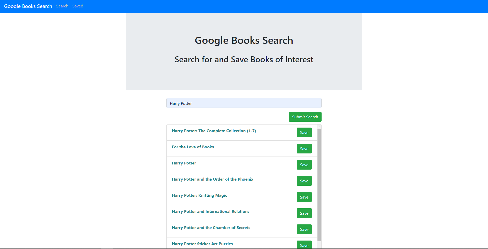

# Google Books Search

## Overview

A React-based Google Books Search app with React components, helper/util functions, and React lifecycle methods to query and display books based on user searches. Also includes Node, Express, and MongoDB so that users can save books to review or purchase later.

### Links

https://whispering-meadow-30542.herokuapp.com/savedbooks

https://github.com/Curtis-Hatter/Books

### Pages

* This application has 2 pages, check out the following mockup images for each page:

  * *Search* - User can search for books via the Google Books API and render them here. User has the option to "View" a book, bringing them to the book on Google Books, or "Save" a book, saving it to the Mongo database.
  

  * *Saved* - Renders all books saved to the Mongo database. User has an option to "View" the book, bringing them to the book on Google Books, or "Delete" a book, removing it from the Mongo database.
  

  * `Book` collection similar to the following:

    ```js
    {
      authors: ["Suzanne Collins"]
      description: "Set in a dark vision of the near future, a terrifying reality TV show is taking place. Twelve boys and twelve girls are forced to appear in a live event called The Hunger Games. There is only one rule: kill or be killed. When sixteen-year-old Katniss Everdeen steps forward to take her younger sister's place in the games, she sees it as a death sentence. But Katniss has been close to death before. For her, survival is second nature."
      image: "http://books.google.com/books/content?id=sazytgAACAAJ&printsec=frontcover&img=1&zoom=1&source=gbs_api"
      link: "http://books.google.com/books?id=sazytgAACAAJ&dq=title:The+Hunger+Games&hl=&source=gbs_api"
      title: "The Hunger Games"
    }
    ```

- - -

### Layout 
Single Page Application that uses [`react-router-dom`](https://github.com/reactjs/react-router) to navigate, hide and show React components without changing the route within Express.

* The layout inlcudes at least two React Components for each page `Search` and `Saved`.

#### Express routes

* `/api/books` (get) - Returns all saved books as JSON.

* `/api/books` (post) - Saves a new book to the database.

* `/api/books/:id` (delete) - Deletes a book from the database by Mongo `_id`.

* `*` (get) - Will load single HTML page in `client/build/index.html`.

